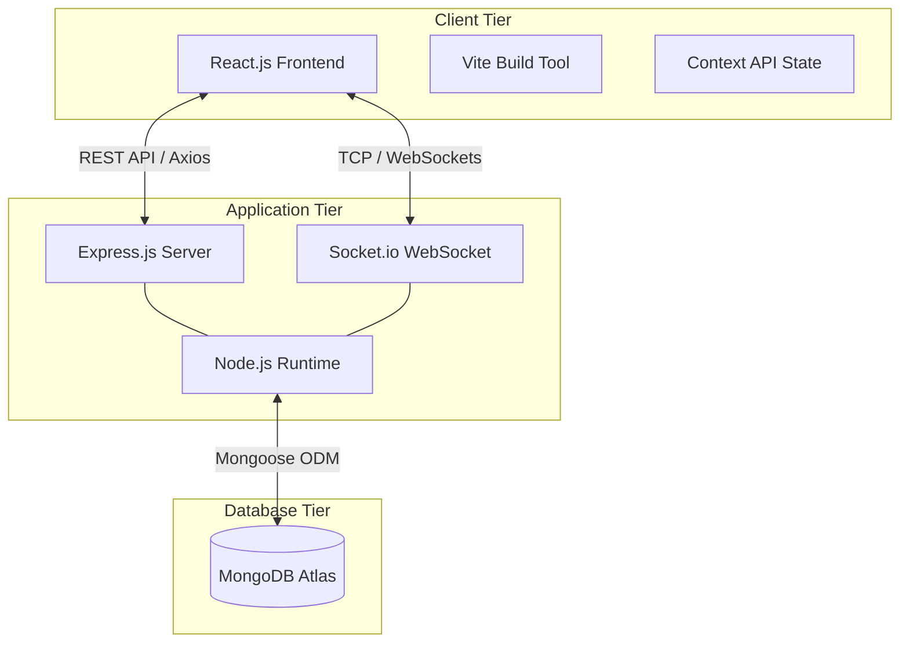
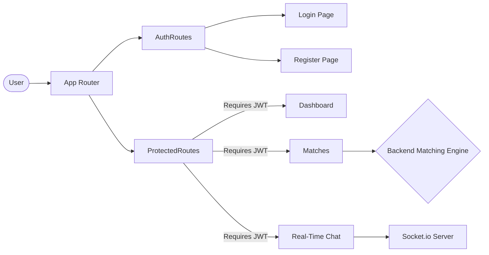
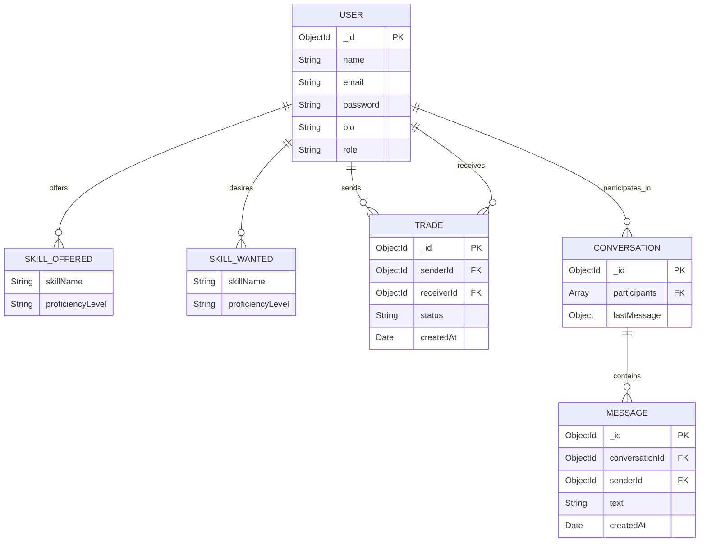
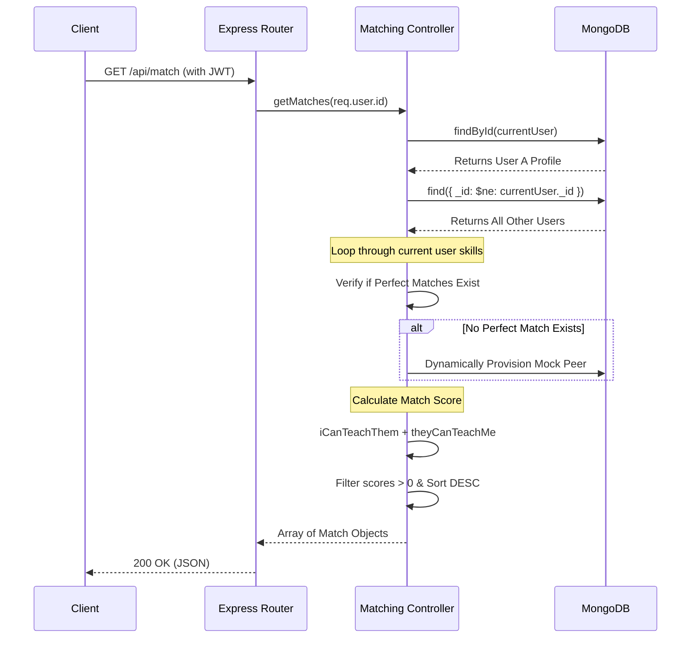
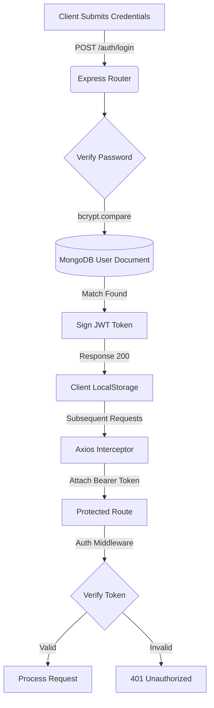

# Skill Bridge System Architecture

This document provides a comprehensive technical overview of the system architecture for the Skill Bridge Peer-to-Peer Skill Exchange platform. 

## 1. High-Level MERN Architecture

Skill Bridge follows a standard 4-tier MERN stack architecture designed for horizontal scalability and real-time responsiveness.

## 2. Component Flow & Routing

The frontend utilizes React Router for protected navigation and Axios interceptors for authenticated API requests.

## 3. Entity-Relationship (ER) Model

The NoSQL database relies on referenced document relationships to ensure data integrity while maintaining high read/write speeds.

## 4. Intelligent Matching Algorithm Flow

The core backend algorithm processes user data to calculate bilateral compatibility scores.

## 5. Security & Authentication Flow

