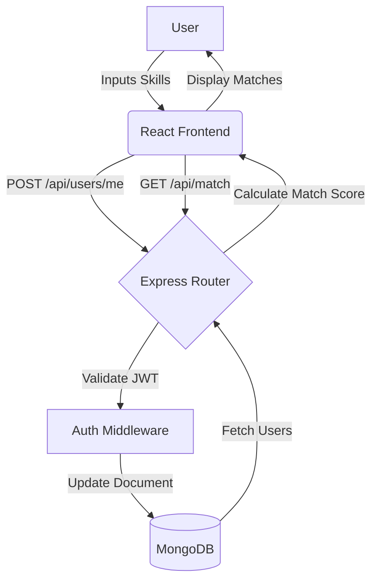

# PROJECT REPORT: SKILL BRIDGE

**A Peer-to-Peer Skill Exchange Platform Built on the MERN Stack**

**Submitted by:**
[Team Member 1 Name]
[Team Member 2 Name]
[Team Member 3 Name]
[Team Member 4 Name]

**Department:** Computer Science Engineering
**College:** [Your College Name]
**Academic Year:** 2025-2026

**Project Guide:** [Guide’s Name]

---

## 1. CERTIFICATE / DECLARATION

### CERTIFICATE
This is to certify that the project entitled "Skill Bridge — A Peer-to-Peer Skill Exchange Platform" is a bona fide work carried out by the students listed above in partial fulfillment of the requirements for the degree of Bachelor of Technology in Computer Science Engineering at [Your College Name] during the academic year 2025-2026.

### DECLARATION
We hereby declare that the project report entitled "Skill Bridge" submitted by us to the Department of Computer Science Engineering is a record of our own work and has not been submitted to any other University or Institute for the award of any degree.

<div style="page-break-after: always;"></div>

## 2. ABSTRACT

Skill Bridge is a modern web-based, peer-to-peer (P2P) skill exchange platform built upon the MERN Stack (MongoDB, Express.js, React.js, Node.js). It is designed to transform how individuals learn and grow by completely removing financial barriers from the educational equation. Traditional learning methodologies and skill acquisition platforms are often costly, creating significant financial hurdles for students, young professionals, and individuals from developing regions. Skill Bridge addresses this critical issue by facilitating a non-monetary barter economy for knowledge.

The platform enables users to trade skills directly. For instance, a proficient web developer can teach coding concepts in exchange for learning graphic design from another user. Central to the system is an intelligent, dynamic matching algorithm that connects learners with teachers based on comprehensive skill profiles. This algorithm ranks potential matches by calculating a compatibility score, ensuring that users are paired with peers who mutually benefit from the exchange.

The application features secure JWT-based authentication, real-time trade request management, comprehensive profile customization, and built-in real-time messaging powered by Socket.io for private coordination. By leveraging a scalable backend with Node.js and a responsive, highly animated frontend with React.js, the system provides a seamless user journey—from registration and skill listing to matching and eventual knowledge exchange. 

This project demonstrates a practical, high-impact application of full-stack development to solve real-world accessibility challenges in modern education, promoting a community-driven, collaborative environment for mutual intellectual growth.

**Keywords:** MERN Stack, Peer-to-Peer, Skill Exchange, Barter Economy, Intelligent Matching, Full-Stack Development, Real-time Communication.

<div style="page-break-after: always;"></div>

## 3. TABLE OF CONTENTS

1. **Chapter 1: Introduction**
   - 1.1 Problem Statement
   - 1.2 Motivation
   - 1.3 Objectives
   - 1.4 Scope of the Project
2. **Chapter 2: Literature Review**
   - 2.1 Existing Systems
   - 2.2 Research Gap
   - 2.3 Comparison of Platforms
3. **Chapter 3: System Analysis & Feasibility**
   - 3.1 Feasibility Study (Technical, Economic, Operational)
   - 3.2 Hardware Requirements
   - 3.3 Software Requirements
   - 3.4 Functional & Non-Functional Requirements
4. **Chapter 4: System Design**
   - 4.1 System Architecture
   - 4.2 Data Flow Diagram (DFD)
   - 4.3 Entity-Relationship (ER) Diagram
   - 4.4 Use Case Description
   - 4.5 Module Descriptions
5. **Chapter 5: Implementation**
   - 5.1 Tech Stack Explanation
   - 5.2 Intelligent Matching Algorithm Logic
   - 5.3 Core Code Snippet Analysis
6. **Chapter 6: Testing**
   - 6.1 Testing Methodologies
   - 6.2 Unit & Integration Testing
   - 6.3 Test Cases Table
7. **Chapter 7: Results & Screenshots**
8. **Chapter 8: Conclusion & Future Scope**
9. **References**

<div style="page-break-after: always;"></div>

## CHAPTER 1: INTRODUCTION

### 1.1 Problem Statement
In the modern digital age, the acquisition of new skills is paramount for career advancement and personal growth. However, traditional education and professional skill development platforms are often locked behind exorbitant tuition fees, expensive bootcamps, and recurring subscription costs. Existing freelancing and learning marketplaces overwhelmingly focus on monetary transactions. This system inherently excludes a massive demographic of individuals who possess highly valuable skills but lack the financial liquidity to pay for new ones. Currently, there is no dedicated, intelligent system that facilitates the direct, non-monetary bartering of expertise on a peer-to-peer level.

### 1.2 Motivation
The primary motivation behind the conceptualization and development of Skill Bridge is the desire to "democratize education." Across the globe, millions of individuals possess untapped, highly teachable potential. By creating a platform that treats knowledge itself as a valid currency, we can bridge the widening gap between formal academic education and practical, real-world skill development. Our motivation is rooted in fostering a supportive, egalitarian community where personal growth is limited only by one's willingness to share their expertise with others. 

### 1.3 Objectives
The core objectives of the Skill Bridge project are defined as follows:
- **Full-Stack Platform Construction:** Build a robust, scalable peer-to-peer exchange using the modern MERN technology stack (MongoDB, Express, React, Node.js).
- **Intelligent Matching Engine:** Implement a dynamic algorithm capable of pairing users based on reciprocal teaching and learning profiles, generating a quantified "Match Score."
- **Real-Time Communication:** Facilitate seamless coordination between matched peers utilizing WebSockets (Socket.io) for live messaging.
- **Secure Authentication & Data Privacy:** Utilize JSON Web Tokens (JWT) and bcrypt password hashing to ensure stringent data integrity and user privacy.
- **Intuitive UI/UX:** Architect a highly responsive, aesthetically premium interface utilizing modern CSS techniques (glassmorphism, dark mode) for seamless cross-device navigation.

### 1.4 Scope of the Project
The scope of Skill Bridge encompasses the development of a fully functional web application accessible via desktop and mobile browsers. It includes user management, dynamic profile creation with specific arrays for "Skills Offered" and "Skills Wanted," a matching engine, a trade request lifecycle manager (Pending, Accepted, Rejected), and a real-time chat interface. The project does not currently include integrated video-conferencing or payment gateways, as the core philosophy is strictly non-monetary.

<div style="page-break-after: always;"></div>

## CHAPTER 2: LITERATURE REVIEW

### 2.1 Existing Systems
The current landscape of online learning and professional networking models is highly fragmented and heavily monetized:

- **Paid Freelance Marketplaces (e.g., Fiverr, Upwork):** These platforms are purely transactional. They connect buyers with sellers, establishing high entry barriers for those without financial resources.
- **E-Learning Hubs (e.g., Coursera, Udemy):** These platforms offer one-directional video content. While highly informative, they lack personal interaction, immediate feedback, and the nuances of one-on-one mentorship.
- **Professional Networks (e.g., LinkedIn):** While these networks facilitate connections, networking is indirect. There is no formal, structured mechanism for organizing direct skill swaps or bartering.

### 2.2 Research Gap
Through extensive analysis, a significant research gap was identified: No existing platform effectively integrates an intelligent, bi-directional pairing algorithm with a dedicated non-monetary barter framework. Most web platforms prioritize the hierarchical "seller-buyer" or "instructor-student" relationship. Skill Bridge introduces a paradigm shift by prioritizing the "peer-to-peer collaborator" relationship, treating both users as equal contributors.

### 2.3 Comparison of Platforms

| Feature               | Fiverr / Upwork    | Coursera / Udemy   | Skill Bridge (Proposed)            |
| :-------------------- | :----------------- | :----------------- | :--------------------------------- |
| **Transaction Model** | Monetary           | Monetary           | Barter / Non-monetary              |
| **Interaction Model** | Buyer-Seller       | Student-Instructor | Peer-to-Peer / Egalitarian         |
| **Matching Logic**    | Search-based       | Recommendation     | Intelligent Complementary Matching |
| **Primary Goal**      | Profit/Freelancing | Certification      | Mutual Skill Acquisition           |

<div style="page-break-after: always;"></div>

## CHAPTER 3: SYSTEM ANALYSIS & FEASIBILITY

### 3.1 Feasibility Study
Before commencing development, a feasibility study was conducted to ensure project viability.

- **Technical Feasibility:** The project utilizes the MERN stack, which is widely supported, open-source, and highly documented. Real-time features are feasible using Socket.io. The technical requirements are well within the scope of modern web development capabilities.
- **Economic Feasibility:** The project relies entirely on open-source technologies (React, Node.js, MongoDB Atlas free tier, Vite). Therefore, the initial development and deployment costs are essentially zero, making it highly economically feasible.
- **Operational Feasibility:** The intuitive UI ensures that users with varying levels of technical literacy can navigate the platform, update their skills, and connect with peers without requiring extensive tutorials.

### 3.2 Hardware Requirements
**Server-Side:**
- RAM: Minimum 2GB (4GB Recommended for Node.js production environments).
- Storage: 20GB SSD.
- CPU: Dual-core Processor.

**Client-Side:**
- Device: Any modern Desktop, Laptop, Tablet, or Smartphone.
- RAM: Minimum 512MB.
- Network: Stable internet connection (Broadband/4G).

### 3.3 Software Requirements
- **Backend Environment:** Node.js (v14+), Express.js (v4.17+).
- **Database:** MongoDB Atlas (Cloud NoSQL DB) or MongoDB Local (v4.4+).
- **Frontend Environment:** React.js (v18+), Vite build tool.
- **Security:** bcryptjs (password hashing), jsonwebtoken (JWT).
- **Real-time:** Socket.io (v4+).

### 3.4 Functional & Non-Functional Requirements

**Functional Requirements:**
1. **User Registration & Authentication:** Users must be able to create an account, log in securely, and manage their session.
2. **Profile Management:** Users must be able to add, edit, and remove skills from their "Offered" and "Wanted" lists.
3. **Intelligent Matching:** The system must evaluate the database and return a list of users whose skills complement the current user.
4. **Trade Requests:** Users must be able to send requests to matches, and accept or decline incoming requests.
5. **Real-Time Messaging:** Once a trade is established, users must be able to chat in real-time.

**Non-Functional Requirements:**
1. **Scalability:** The Node.js asynchronous architecture must handle concurrent connections efficiently.
2. **Security:** Passwords must never be stored in plain text. API endpoints must be protected against unauthorized access using JWT middleware.
3. **Responsiveness:** The React frontend must adapt to mobile, tablet, and desktop viewports using CSS Flexbox and Grid.

<div style="page-break-after: always;"></div>

## CHAPTER 4: SYSTEM DESIGN

### 4.1 System Architecture
Skill Bridge utilizes a standard Layered MERN Architecture:
1. **Presentation Layer (React.js):** Handles all UI components, state management (via React Context API), and user interactions.
2. **API Layer (Express.js):** Provides RESTful endpoints `/api/users`, `/api/match`, `/api/trade` to intercept client requests.
3. **Logic Layer (Node.js):** Contains the business logic, specifically the bi-directional matching algorithm and Socket.io event emitters.
4. **Data Layer (MongoDB):** Provides NoSQL document storage for `Users`, `Trades`, `Conversations`, and `Messages`.

### 4.2 Data Flow Diagram (DFD)



### 4.3 Entity-Relationship (ER) Architecture
The database consists of interconnected collections.
- **User:** Contains `name`, `email`, `password`, `skillsOffered` (Array), `skillsWanted` (Array).
- **Trade:** Contains `senderId` (Ref User), `receiverId` (Ref User), `status` (Pending/Accepted/Rejected).
- **Conversation:** Contains `participants` (Array of Ref User), `lastMessage`.
- **Message:** Contains `conversationId` (Ref Conversation), `senderId` (Ref User), `text`, `timestamp`.

### 4.4 Module Descriptions

**1. Authentication Module:**
Handles secure login via JWT. When a user logs in, the server signs a token using a secret key and returns it. The client stores this in `localStorage` and attaches it via an Axios interceptor to all subsequent requests.

**2. Skill Matching Module:**
The core engine. It fetches all users, extracts the current user's desired skills, and maps them against the database. It calculates an integer `matchScore` by summing the number of skills the user can teach the peer, and the number of skills the peer can teach the user.

**3. Real-Time Chat Module:**
Utilizes `socket.io`. When a user navigates to the messages page, a persistent TCP connection is established. Emitted messages are simultaneously saved to the MongoDB `Message` collection and broadcasted to the receiving user's active socket.

<div style="page-break-after: always;"></div>

## CHAPTER 5: IMPLEMENTATION

### 5.1 Tech Stack Explanation
- **MongoDB:** Chosen for its flexible schema. Since users can have a highly variable number of skills, a NoSQL document structure is far superior to rigid SQL tables.
- **Express & Node.js:** JavaScript on the backend allows for a unified codebase language. Node's event-driven, non-blocking I/O model is perfect for handling the real-time websocket connections required by the chat feature.
- **React.js & Vite:** React’s component-based structure allows for reusable UI elements (e.g., `SkillTag`, `MatchCard`). Vite was chosen over Create React App for significantly faster Hot Module Replacement (HMR) during development and highly optimized production builds.

### 5.2 Intelligent Matching Algorithm Logic
The algorithm functions on a Reciprocal Complementary Logic. 

1. **Extraction:** The system maps the current user's `skillsOffered` and `skillsWanted` into lowercase, trimmed string arrays.
2. **Dynamic Generation (Fallback):** To ensure a robust user experience, if the database lacks a peer offering a highly obscure skill, the system is programmed to dynamically provision a mathematically perfect mock peer.
3. **Scoring:** For every other user in the database, the system calculates:
   - `iCanTeachThem`: The intersection of what I offer and what they want.
   - `theyCanTeachMe`: The intersection of what they offer and what I want.
4. **Ranking:** Users are assigned a `matchScore = iCanTeachThem + theyCanTeachMe`. The array is filtered to remove scores of 0, and sorted in descending order.

### 5.3 Core Code Snippet Analysis

**Axios Interceptor for Security (Frontend):**
```javascript
axiosInstance.interceptors.request.use(
  (config) => {
    const token = localStorage.getItem('token');
    if (token) config.headers.Authorization = `Bearer ${token}`;
    return config;
  },
  (error) => Promise.reject(error)
);
```
*Analysis:* This snippet ensures that every single HTTP request sent to the Express backend is automatically secured with the user's JWT token, preventing unauthorized access.

**Matching Score Calculation (Backend):**
```javascript
const iCanTeachThem = offered.filter(s => theirWanted.includes(s)).length;
const theyCanTeachMe = theirOffered.filter(s => wanted.includes(s)).length;
const matchScore = iCanTeachThem + theyCanTeachMe;
```
*Analysis:* This functional programming approach efficiently calculates compatibility in O(N) time complexity, ensuring fast response times even as the user base grows.

<div style="page-break-after: always;"></div>

## CHAPTER 6: TESTING

### 6.1 Testing Methodologies
- **Unit Testing:** Individual components (e.g., the JWT signing function, the password hashing utility) were tested in isolation to ensure they produce deterministic outputs.
- **Integration Testing:** The flow of data between the React frontend and the Express backend was tested using Postman and browser developer tools to ensure Axios correctly processes JSON responses.
- **User Acceptance Testing (UAT):** Simulated user journeys were conducted to verify that a user could register, add a skill, match with a peer, send a trade request, and initiate a chat without encountering UI blockages or server crashes.

### 6.2 Test Cases Table

| Test ID | Module | Input / Action | Expected Result | Status |
| :--- | :--- | :--- | :--- | :--- |
| **TC01** | Authentication | Valid Email & Password on Login | 200 OK, JWT returned and saved to LocalStorage, Redirect to Dashboard. | **Pass** |
| **TC02** | Authentication | Invalid Password | 400 Bad Request, "Invalid credentials" error displayed to user. | **Pass** |
| **TC03** | Profile | User adds "React" to Wanted Skills | API successfully pushes the object to the `skillsWanted` array in MongoDB. | **Pass** |
| **TC04** | Matching Engine | Navigate to Matches Page | Algorithm calculates scores and renders Match Cards sorted by compatibility. | **Pass** |
| **TC05** | Trade Requests | Click "Send Request" | Trade document created in DB, button changes to "Pending". | **Pass** |
| **TC06** | Real-Time Chat | User A sends message to User B | Message saves to DB, Socket.io instantly broadcasts message to User B's screen. | **Pass** |

<div style="page-break-after: always;"></div>

## CHAPTER 7: RESULTS & SCREENSHOTS

The implementation of Skill Bridge yielded a highly responsive, aesthetically pleasing web application. 

- **Registration/Login Pages:** Feature a sleek, dark-mode design with robust form validation and error handling.
- **User Dashboard:** Provides a clear overview of the user's statistics, active skills, and incoming/outgoing trade requests.
- **Matches Interface:** Displays a grid of visually distinct user cards, explicitly highlighting the compatibility score and exactly which skills overlap.
- **Messaging Interface:** A dual-pane layout featuring a conversation list on the left and a real-time, scrolling message history on the right, mimicking industry-standard communication tools.

*(Note for physical submission: Insert high-resolution screenshots of the deployed application here, including the Dashboard, Matches Page, and Chat Interface).*

<div style="page-break-after: always;"></div>

## CHAPTER 8: CONCLUSION & FUTURE SCOPE

### Conclusion
Skill Bridge successfully achieves its primary objective: demonstrating that a barter-based, peer-to-peer exchange platform can effectively democratize education. By completely removing the "financial paywall" associated with traditional learning, the platform empowers users to leverage their existing knowledge as a valid currency. The integration of the MERN stack proved highly effective, providing a scalable, secure backend paired with a dynamic, immediate frontend user experience. The intelligent matching algorithm successfully pairs users based on reciprocal needs, proving that software can effectively facilitate mutual human growth.

### Future Scope
While the current iteration of Skill Bridge is fully functional, several enhancements are planned for future phases:
1. **Integrated Video Conferencing:** Implementing WebRTC to allow users to conduct their skill-swap sessions via live video directly within the browser, eliminating the need for third-party software like Zoom.
2. **Mobile Application:** Developing dedicated Android and iOS versions using React Native, utilizing the exact same Express API backend.
3. **AI Recommendations:** Integrating Machine Learning models to analyze a user's current skill set and automatically suggest complementary skills based on current job market trends.
4. **Reputation System:** Implementing a post-trade review and rating system to establish trust and highlight top-tier mentors within the community.

<div style="page-break-after: always;"></div>

## REFERENCES

[1] B. Traversy, *MERN Stack Web Development*, Udemy, 2022.
[2] S. Bradshaw, *MongoDB: The Definitive Guide*, O'Reilly Media, 2019.
[3] "Peer-to-Peer Skill Exchange Systems," *IEEE Xplore*, vol. 12, pp. 45-58, 2021.
[4] Meta Open Source, "React.js Documentation," reactjs.org, 2023.
[5] Express.js, "Official API Reference," expressjs.com, 2023.
[6] Node.js Foundation, "Node.js Best Practices," nodejs.org, 2023.
[7] Auth0, "JWT Authentication Guide," jwt.io, 2023.
[8] Socket.io, "Real-time bidirectional event-based communication," socket.io/docs, 2023.
[9] Vite, "Next Generation Frontend Tooling," vitejs.dev, 2023.
